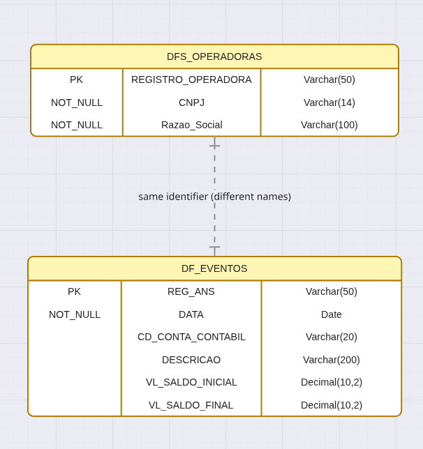

# IntuitiveCare - Desafio Técnico



> **Nota**: O foco principal deste projeto foi no **web scraping, tratamento de dados e banco de dados** (Testes 1, 2 e 3). A API REST (Teste 4) foi implementada com as rotas básicas, mas pretendo evoluir com mais funcionalidades futuramente.

## Teste 1 - Web Scraping e Processamento de Dados

No notebook de data analysis, optei por processar os arquivos em chunks de 100 mil, por meio da função api_requests, usando protocolo https. A função baixa e descompacta, criando um diretório data. 

Após isso, analisei as colunas dos DF dos trimestres de 2025, e notei duas colunas importantes: DESCRICAO e CD_CONTA_CONTABIL. A primeira abordagem foi tentar identificar qual CD_CONTA_CONTABIL seria relacionado a eventos / sinistros, porém acabei notando que não está padronizado, e pela descrição vários outros dados estavam passando. 

Optei então por identificar a string de descrição, normalizando tudo da coluna para upper e identifiquei eventos e sinistros utilizando regex `(?=.*EVENT)(?=.*SINISTR)`. Assim, foi feita a consolidação dos dados em um único csv.

### Análise dos arquivos de operadoras

Baixei todos os arquivos de operadoras inicialmente. No desafio 1.3 é necessário criar um .csv com colunas: CNPJ, RazaoSocial, Trimestre, Ano, ValorDespesaTotal. 

Através da análise dos arquivos, notei que os arquivos de **operadoras de plano de saúde** são os que devem ser utilizados na análise, pois operadoras não hospitalares e operadoras acreditadas não possuem informações necessárias.

## Teste 2 - Tratamento de Dados

### Problemas encontrados:
- Arquivos inconsistentes com despesas negativas e zeradas
- CNPJs duplicados
- Razões sociais diferentes para mesmo CNPJ

### Tratamentos aplicados:
- **Valores NULL em campos obrigatórios**: Removidos registros com CNPJ, Razão Social ou Registro ANS vazios
- **Strings em campos numéricos**: Uso de `pd.to_numeric(errors='coerce')` para converter, valores inválidos viram NaN
- **Datas inconsistentes**: Uso de `pd.to_datetime(errors='coerce')` para padronizar formato YYYY-MM-DD
- **Validação de CNPJ**: Biblioteca `validate-docbr` para validar CNPJs (formato e dígito verificador)
- **Duplicatas**: Removidas por CNPJ + Trimestre, mantendo primeiro registro
- **Valores negativos/zero**: Filtrados registros com `ValorDespesas > 0`
- **Trimestres inválidos**: Aceitos apenas 1T, 2T, 3T

### Trade-off 2.2 - Merge de dados
No merge entre despesas e operadoras ativas, usei `how='inner'` para garantir que só entrem registros com correspondência em ambas as tabelas.

### Trade-off 2.3 - Ordenação
Optei por `sort_values` pois o volume de dados não é significativo. Caso fosse maior, seguiria abordagem dos chunks novamente.

### Por que `index=False` no to_csv?

Quando você salva um DataFrame com `df.to_csv()`, por padrão o pandas inclui uma coluna extra com o índice (0, 1, 2, 3...). Isso gera problemas:

1. **Coluna desnecessária** no CSV que não faz parte dos dados
2. **Erro na importação SQL** - o PostgreSQL espera N colunas, mas recebe N+1
3. **Poluição visual** - uma coluna "Unnamed: 0" aparece ao ler o CSV de volta

Por isso usamos `index=False` para exportar apenas as colunas de dados.

## Teste 3 - Banco de Dados


Tabelas criadas:
- `operadora` - Dados do Relatorio_cadop.csv (1110 registros)
- `despesa_trimestral` - Dados consolidados por trimestre (1501 registros)
- `despesa_agregada` - Dados agregados por operadora/UF (505 registros)

**Decisão de não normalizar**: Com apenas ~1500 registros de despesas e ~1100 operadoras, a normalização adicionaria complexidade desnecessária. O volume não justifica JOINs adicionais.

## Teste 4 - API REST

### Rotas implementadas:

| Método | Rota | Descrição |
|--------|------|-----------|
| GET | `/operadoras` | Lista operadoras com paginação |
| GET | `/operadoras/busca?q=termo` | Busca por razão social ou CNPJ |
| GET | `/operadoras/{registro}` | Detalhe de uma operadora |
| GET | `/despesas/trimestral` | Lista despesas trimestrais |
| GET | `/despesas/agregadas` | Lista despesas agregadas |
| GET | `/despesas/top10` | Top 10 maiores despesas |

### Paginação por Offset - Justificativa

Optei por **paginação por offset** (`LIMIT/OFFSET`) ao invés de cursor-based pelos seguintes motivos:

1. **Volume pequeno de dados**: Com ~1100 operadoras e ~1500 despesas, o overhead do offset é desprezível. O problema de performance do offset (scan de N registros) só se manifesta com milhões de registros.

2. **Simplicidade de implementação**: Offset permite navegação direta para qualquer página (`?offset=50&limite=10` = página 6), enquanto cursor exige navegação sequencial.

3. **Compatibilidade com UI**: A maioria das bibliotecas de tabela/grid (DataTables, AG Grid, etc) espera paginação por offset com `total` de registros.

4. **Ordenação flexível**: Offset permite ordenar por qualquer coluna sem precisar de índice específico. Cursor-based exige que a coluna de cursor seja única e indexada.

**Trade-off aceito**: Em datasets maiores (>100k registros), cursor-based seria preferível para evitar o scan. Para este caso, offset é a escolha pragmática.

### Como executar a API:

```bash
cd backend
pip install fastapi uvicorn psycopg2-binary
uvicorn api.main:app --reload
```

Acesse: http://localhost:8000/docs.

---

## Considerações Finais

Este projeto foi desenvolvido com foco principal em **web scraping, processamento e tratamento de dados**, que representam a maior parte do trabalho realizado. A API REST foi implementada com as rotas essenciais para consulta dos dados.

**Próximos passos planejados:**
- Expandir a API com mais filtros e endpoints
- Adicionar testes automatizados
- Implementar autenticação
- Criar interface frontend para visualização

Foi um projeto de muito aprendizado, especialmente na integração entre extração de dados, tratamento com pandas e persistência em banco relacional.